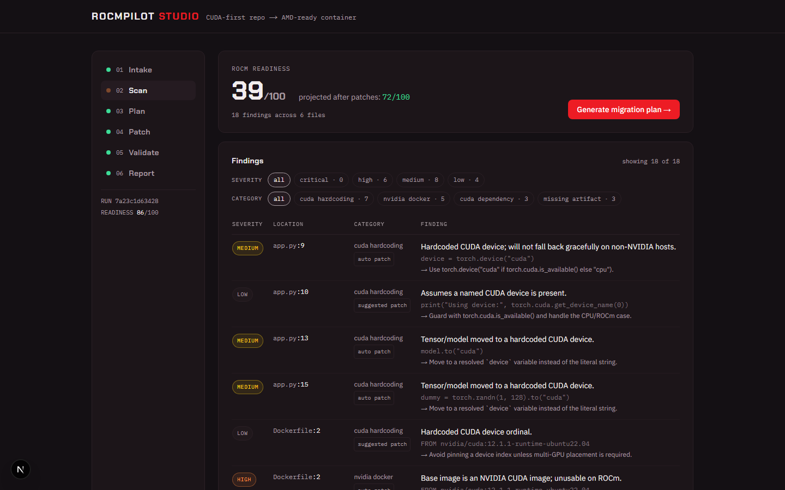
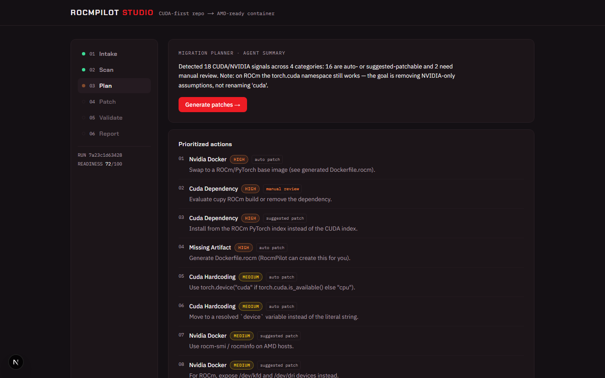
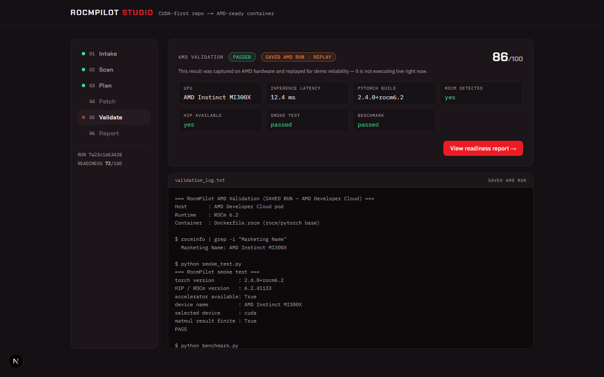
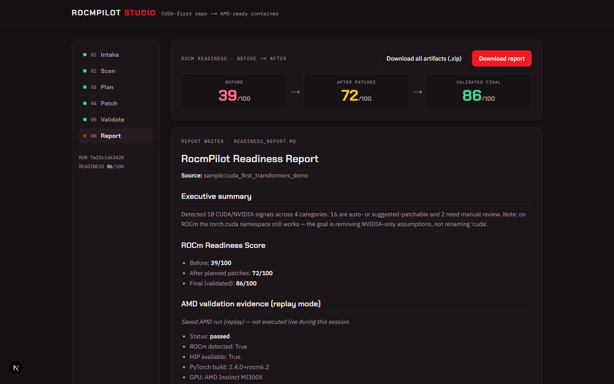

# RocmPilot Studio

**The migration command center that takes a CUDA-first repo to an AMD-ready,
validated deployment — in minutes.**

[](https://github.com/YoussefMadkour/RocmPilot/actions/workflows/ci.yml)

> Point it at a repository URL. It returns an honest AMD-readiness verdict, a
> prioritized migration plan, safe auto-patches, a ready-to-run ROCm container, a
> real validation on AMD hardware, and a before → after readiness score — end to end.

📄 **Read [PITCH.md](PITCH.md) for the story, the tech decisions, and the results.**

Built for the **AMD Developer Hackathon: ACT II**, Track 3 (Unicorn): a
**multi-model agent orchestra** (all AMD-hosted via **Fireworks AI**), grounded in
a ROCm/HIP **RAG knowledge base**, validated on **AMD hardware** (Radeon gfx1100 /
MI300-class via AMD Developer Cloud). Fully containerized; the whole flow also
runs **offline with zero API keys**.

---

## Table of contents

- [The problem](#the-problem)
- [The six-stage flight](#the-six-stage-flight)
- [The cockpit](#the-cockpit)
- [Quick start](#quick-start)
- [Architecture](#architecture)
- [The agent orchestra](#the-agent-orchestra)
- [The readiness score](#the-readiness-score)
- [Validation on AMD](#validation-on-amd)
- [API at a glance](#api-at-a-glance)
- [Repository layout](#repository-layout)
- [Testing & CI](#testing--ci)
- [Environment variables](#environment-variables)
- [Team & workflow](#team--workflow)
- [Limitations & roadmap](#limitations--roadmap)

---

## The problem

Most AI projects are built CUDA-first. Moving them to AMD GPUs means fighting
hardcoded `cuda` device logic, `nvidia/cuda` base images, CUDA-only wheels
(`+cu121`), missing ROCm setup, and confusing errors — with no clear signal on
whether a repo can even run on AMD. RocmPilot replaces that guesswork with a
measured, evidence-backed migration pipeline.

## The six-stage flight

Every run moves through one enforced pipeline (out-of-order calls return `409`;
the UI's flight-check rail mirrors it with live status LEDs):

| # | Stage | What happens | What you get |
|---|-------|--------------|--------------|
| 01 | **Intake** | Paste a GitHub URL or use the bundled sample. Cloning is hardened: scheme/host allowlist, SSRF guard, size/time limits, token redaction. Recent runs are one click away. | a run id |
| 02 | **Scan** | Deterministic scanner (zero LLM): 20+ regex patterns, per-line deduped, plus a **kernel-risk classifier** for the hard tail — warp/wavefront-64 hazards (`__shfl`, `__ballot`, `warpSize`), WMMA tensor cores, CUTLASS, texture memory, and CUDA libraries mapped to their ROCm twins (cuBLAS→hipBLAS, cuDNN→MIOpen, NCCL→RCCL, …) | findings with file : line, severity, category, recommended fix + the **before** score |
| 03 | **Plan** | The Orchestrator has **DeepSeek** draft a prioritized plan, then a **different model (GLM)** critiques it against the raw findings before you ever see it — streamed live over SSE, agent by agent | plan + independent critique + agent-activity trace |
| 04 | **Patch** | Conservative, idempotent transforms guard `torch.device("cuda")`, `.cuda()`, `.to("cuda")`, and `device = "cuda"` assignments; ROCm artifacts are generated from hardened templates | `patch.diff`, `Dockerfile.rocm`, `smoke_test.py`, `benchmark.py`, each change explained in plain English from the real diff |
| 05 | **Validate** | Runs (or replays a clearly labeled saved run of) the AMD/ROCm smoke test + benchmark; on failure the **research agent (Kimi)** returns a *cited*, RAG-grounded diagnosis | pass/fail, GPU name, HIP/ROCm status, latency + the **final** score |
| 06 | **Report** | **GLM** writes the judge-ready Markdown debrief | `readiness_report.md`, plus **the patched repo as a zip** — fixes applied + ROCm files, ready to build and run |

## The cockpit

| | |
|---|---|
|  |  |
| **Scan** — deterministic findings + kernel-risk callout | **Plan** — live-streamed agent trace, Critic review |
|  |  |
| **Validate** — real AMD evidence, honestly labeled | **Report** — before → after → validated + downloads |

---

## Quick start

### Docker

```bash
git clone https://github.com/YoussefMadkour/RocmPilot.git && cd RocmPilot
docker compose up --build     # backend :8000, frontend :3000
```

Open http://localhost:3000 and click **Scan the bundled CUDA-first sample repo**.
No `.env` required: with no keys, every agent falls back to a deterministic
response and the full flow completes offline. Add keys to make it smarter:

```bash
cp .env.example .env                      # set FIREWORKS_API_KEY (+ Qdrant for RAG)
cd backend && python -m app.knowledge.ingest   # build the knowledge base once
```

### Without Docker

Backend (Python 3.12):
```bash
cd backend
python3 -m venv .venv && source .venv/bin/activate   # Windows: .venv\Scripts\activate
pip install -r requirements.txt
uvicorn app.main:app --reload           # http://localhost:8000/docs
```

Frontend (Node 22+):
```bash
cd frontend
npm install
npm run dev                             # http://localhost:3000
```

### Tests

```bash
cd backend
pip install -r requirements-dev.txt
pytest          # 165+ tests, all deterministic — no network, no LLM, no GPU needed
```

---

## Architecture

```
┌─────────────────────────┐      HTTP / SSE       ┌───────────────────────────────┐
│  frontend (Next.js 16)  │ ───────────────────▶  │  backend (FastAPI, py3.12)    │
│  6 cockpit screens      │ ◀───────────────────  │  app/main.py — 15 endpoints   │
│  lib/api.ts typed client│   live agent traces   │                               │
└─────────────────────────┘                       │  services/  (deterministic)   │
                                                  │   scanner + kernel-risk       │
                                                  │   scoring · repo · patch      │
                                                  │   dockerfile · smoke · bench  │
                                                  │   validation · report · store │
                                                  │                               │
                                                  │  agents/    (Fireworks AI)    │
                                                  │   orchestrator → planner      │
                                                  │              → critic         │
                                                  │   patch_explainer             │
                                                  │   failure_diagnoser (research)│
                                                  │   report_writer               │
                                                  │                               │
                                                  │  knowledge/ (RAG, optional)   │
                                                  │   ROCm/HIP docs → Qdrant      │
                                                  └──────────┬────────────────────┘
                                                             │
                                     ┌───────────────────────┼──────────────────────┐
                                     ▼                       ▼                      ▼
                              Fireworks AI API       backend/runs/<id>/       AMD hardware
                              (multi-model,          state.json + artifacts   (gfx1100 capture,
                               AMD-hosted)                                     MI300-class)
```

**State is a file.** Each run lives at `backend/runs/<id>/` — a `state.json`
carrying stage, findings, plan, critique, trace, artifacts, explanations,
validation, and scores, plus the generated files and the cloned `source/`.
Every endpoint is independently callable; screens hydrate from cached state
(`GET /api/runs/{id}`) and only compute when needed.

### Design rules (what makes it credible)

1. **The scanner is deterministic. The LLM only explains.** Every finding, score,
   and artifact comes from plain Python in `services/`. An LLM is never the thing
   that "detects a CUDA string" — findings are reproducible and trustworthy.
2. **Agents degrade gracefully.** No key / API error → deterministic fallback,
   for every agent. The demo can never be taken down by a flaky API.
3. **`torch.cuda` is not NVIDIA.** On ROCm, PyTorch exposes AMD GPUs through the
   `torch.cuda` namespace. RocmPilot does **not** rewrite `"cuda"` → `"rocm"`; it
   removes NVIDIA-only *assumptions* and adds availability guards. That nuance is
   the difference between a real tool and find-and-replace.
4. **Honesty is part of the UI.** Replayed validations always wear the ember
   **"Saved AMD run"** badge, every agent output is stamped with the model that
   produced it, and the score is calibrated to reality, not demo drama.

## The agent orchestra

Different jobs want different models — all AMD-hosted via Fireworks, each with a
deterministic fallback, each surfaced in the UI with a model badge:

| Agent | Model | Stage | Job |
|-------|-------|-------|-----|
| **Orchestrator** | (code) | Plan | Coordinates Planner → Critic; emits the trace streamed to the UI |
| **Migration Planner** | DeepSeek-v4-pro | Plan | Structured, prioritized migration plan (JSON-validity hardened) |
| **Critic** | GLM-5.2 | Plan | An **independent model** reviews the plan against the raw findings — approves or raises issues |
| **Patch Explainer** | GLM-5.2 | Patch | Grounded per-change safety notes from the real before/after diff |
| **Research / Failure Diagnoser** | Kimi-k2.6 | Validate | Long-context log analysis on failure; returns a *cited* fix (RAG + optional Tavily web research) |
| **Report Writer** | GLM-5.2 | Report | Six-section, honest, judge-ready Markdown |

**RAG knowledge base:** curated ROCm/HIP/HIPIFY chunks plus real AMD docs pulled
by a bounded crawler, embedded with `nomic-embed-text` and stored in Qdrant.
Fully optional and fallback-safe — no `QDRANT_URL` means retrieval is a no-op.

## The readiness score

0–100, deterministic, and honest by design:

- Start at 100 and subtract a **blocker penalty** — weighted by category and
  severity, sensitive to finding *count* with diminishing returns.
- Subtract an **unvalidated penalty (−12)**: a repo never proven on AMD cannot
  score 100, however clean.
- **After patches** the score caps at **72** — patched is not proven.
- **Validation** lifts the cap: **+10** smoke test, **+4** benchmark, **−25** on
  failure.

The bundled sample tells the demo story **37 → 72 → 86**. Real repos score
honestly (bands locked by tests so weight changes can't drift silently):
ROCm-transparent apps land high (nanoGPT ~67, Real-ESRGAN ~65, YOLOv5 ~55);
custom-kernel libraries land low (detectron2 ~12, flash-attention ~17) and get
HIPIFY guidance instead of false promises. Full tier list:
[docs/BENCHMARK_REPOS.md](docs/BENCHMARK_REPOS.md).

## Validation on AMD

Set `VALIDATION_MODE`:

| Mode | What it does |
|------|--------------|
| `replay` *(default)* | Replays a **real captured AMD run** — smoke test PASSED on a Radeon gfx1100 (RDNA3), ROCm 7.2, PyTorch 2.9.1, ~0.84 ms inference — always labeled "Saved AMD run" in the UI |
| `replay_fail` | Replays a saved failing run so the research agent's cited diagnosis can be demoed in seconds |
| `live` | Builds `Dockerfile.rocm`, runs `smoke_test.py` + `benchmark.py`, parses their PASS/FAIL markers; falls back to replay when Docker/AMD hardware is unavailable |

Reproduce or re-capture: [docs/AMD_SETUP.md](docs/AMD_SETUP.md) explains where
AMD fits and how to run it; `scripts/amd_capture.ipynb` captures a fresh
validation on an AMD box, and `scripts/run_nanogpt_on_amd.ipynb` runs a
RocmPilot-patched nanoGPT on AMD until it generates text.

## API at a glance

Full wire contract with JSON shapes: [docs/API_CONTRACT.md](docs/API_CONTRACT.md).

```
GET  /api/health                        liveness
GET  /api/runs                          list runs, newest first
POST /api/runs                          create run (repo URL or sample)
GET  /api/runs/{id}                     full cached run state (hydrates screens)
POST /api/runs/{id}/scan                deterministic scan + before score
POST /api/runs/{id}/plan                orchestrated plan + critique + trace
GET  /api/runs/{id}/plan/stream         the same, streamed live (SSE)
POST /api/runs/{id}/patch               patch.diff + ROCm artifacts + explanations
GET  /api/runs/{id}/patch/stream        the same, streamed live (SSE)
POST /api/runs/{id}/validate            AMD validation + final score
GET  /api/runs/{id}/report              judge-ready Markdown report
GET  /api/runs/{id}/artifacts           list artifacts
GET  /api/runs/{id}/artifacts/{name}    one artifact's content
GET  /api/runs/{id}/artifacts.zip       all artifacts as one zip
GET  /api/runs/{id}/patched_repo.zip    the repo with fixes applied + ROCm files
```

## Repository layout

```
backend/
  app/main.py            FastAPI endpoints (order mirrors the demo flow)
  app/models.py          Pydantic models — THE frontend/backend contract
  app/services/          deterministic core: scanner (+ kernel-risk classifier),
                         scoring, repo hardening, patch transforms, dockerfile,
                         smoke_test, benchmark, validation (3 modes), report,
                         run_store
  app/agents/            the orchestra: orchestrator, migration_planner, critic,
                         patch_explainer, failure_diagnoser, report_writer,
                         prompts, json_utils
  app/knowledge/         RAG: curated corpus, ROCm-docs crawler, Qdrant ingest
  app/templates/         Dockerfile.rocm / smoke_test.py / benchmark.py
  app/fixtures/          real captured AMD runs (pass + fail) + benchmark.json
  tests/                 165+ deterministic pytest cases
frontend/
  app/                   Next.js 16 App Router — the 6 cockpit screens
  components/            flight-check rail, badges
  lib/api.ts             typed API client (mirrors models.py)
  DESIGN.md              design direction — read before touching UI
docs/
  ARCHITECTURE.md        diagram + design rules
  API_CONTRACT.md        wire contract (models.py + api.ts + this move together)
  AMD_SETUP.md           where AMD fits + how to run/capture on AMD hardware
  BENCHMARK_REPOS.md     calibration repos + tier list
  DEMO_SCRIPT.md         the 3-minute demo
  screenshots/           README gallery
scripts/                 AMD capture + patched-nanoGPT notebooks
PITCH.md                 the submission story: problem, decisions, results
PROJECT_TRACKER.md       phases, owners, acceptance criteria
```

## Testing & CI

- **165+ pytest cases, all deterministic** — no network, LLM, or GPU required:
  every scanner pattern and the kernel-risk classifier, scoring property tests +
  locked score bands, patch idempotency, agent JSON recovery, clone hardening,
  validation log parsing, artifact zips, RAG plumbing (offline no-op paths).
- **GitHub Actions** ([ci.yml](.github/workflows/ci.yml)): pytest on Python 3.12
  and the production frontend build on Node 22, on every push/PR to `dev`/`main`.

## Environment variables

Everything is optional — blank values mean deterministic fallbacks, never crashes.

| Var | Purpose | Default |
|-----|---------|---------|
| `FIREWORKS_API_KEY` | Enables the agent orchestra + embeddings | — (offline fallbacks) |
| `FIREWORKS_MODEL` | Default model id | `deepseek-v4-pro` |
| `PLANNER/CRITIC/RESEARCH/REPORT/EXPLAINER_MODEL` | Per-agent model overrides | see `config.py` |
| `FIREWORKS_EMBEDDING_MODEL` | RAG embedding model | `nomic-embed-text-v1.5` |
| `QDRANT_URL` / `QDRANT_API_KEY` | RAG knowledge base (no-op if blank) | — |
| `KNOWLEDGE_COLLECTION` / `KNOWLEDGE_TOP_K` | RAG collection + retrieval depth | `rocm_migration_docs` / 5 |
| `TAVILY_API_KEY` | Web research for the failure-diagnosis agent | — |
| `VALIDATION_MODE` | `replay` · `replay_fail` · `live` | `replay` |
| `AMD_VALIDATION_LOG_PATH` | Saved AMD run for replay | bundled real capture |
| `GITHUB_TOKEN` | Clone private repos (redacted from errors/logs) | — |
| `NEXT_PUBLIC_API_BASE_URL` | Frontend → backend URL | `http://localhost:8000` |

> After setting `FIREWORKS_API_KEY` + Qdrant, build the knowledge base once:
> `cd backend && python -m app.knowledge.ingest`

## Team & workflow

- **Youssef** ([@YoussefMadkour](https://github.com/YoussefMadkour)) — backend
  intelligence: scanner core + kernel-risk classifier, scoring, the agent
  orchestra, prompts, RAG, validation, product/demo direction.
- **Jithendra** ([@jithendra-10](https://github.com/jithendra-10)) — the entire
  frontend cockpit (Next.js + the "engine-bay" design system), plus scoped
  backend work: scanner patterns, ROCm templates, list/zip endpoints, the
  original test harness, Docker/CI.

Git workflow: `main` is protected, `dev` is integration. Every change rides a
`feat/*` branch and lands via PR into `dev`; `dev` → `main` ships as a release
PR. One PR = one thing. API-shape changes touch `models.py` + `lib/api.ts` +
`docs/API_CONTRACT.md` in the same PR.

## Limitations & roadmap

Not a full CUDA→ROCm compiler. v1 targets common PyTorch / Hugging Face
**inference** repos. Custom CUDA kernels (`.cu`/`.cuh`), native extensions, and
unsupported operators are **named precisely** by the kernel-risk classifier and
flagged for manual review with HIPIFY guidance — not auto-solved.

**Roadmap:** live validation exercised end-to-end on MI300-class hardware ·
self-heal loop (diagnose → re-patch → re-validate) · automatic GitHub PR with
`patch.diff` · Tier 2 kernel repos (HIPIFY-assisted porting) · SQLite run
history.
